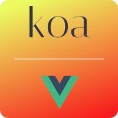

<p align="center"><a href="https://koa-vue-notes-web.innermonkdesign.com/" target="_blank"></a></p>

<p align="center">
  <a href="http://opensource.org/licenses/MIT"></a>
  <a href="https://twitter.com/intent/tweet?url=https%3A%2F%2Fgithub.com%2Fjohndatserakis%2Fkoa-vue-notes-project&text=Check%20out%20koa-vue-notes-project%20on%20GitHub&via=innermonkdesign">
  </a>
</p>

# Koa-Vue-Notes-Project

A single repo containing both the [koa-vue-notes-api](https://github.com/johndatserakis/koa-vue-notes-api) and [koa-vue-notes-web](https://github.com/johndatserakis/koa-vue-notes-web) projects. You can view the project live [here](https://koa-vue-notes-web.innermonkdesign.com/).

# Installing / Getting started

```bash
# install dependencies for the base folder
# and both the api and web projects.
npm install

# server both projects for development
npm run watch

# build both projects for production
npm run build

# run tests for both projects (backend first, then frontend)
npm run test
```

You can take a look at what those scripts do in the `package.json`. Bascially, we do everything in tandem - using the `concurrently` package when necessary. Then, if you need to do something that is specific to the frontend or backend - you jump into those folders directly.

This repo was created because some people like to run their frontend and backend in the same folder. That's cool. And honestly, I see the upside in that - mainly due to the simplicity it brings. So, I've gone ahead and structured this project in a way that both the backend and front end can be run from it. A few of the npm scripts have been adjusted in the base folder, but other than that, the two repos should be extremely similar to their individual repos. If I make any changes in the individual repos I'l do my best to mirror the changes here. Thank you.

## Hit Me Up

Go ahead and fork the project! Message me here if you have questions or submit an issue if needed. I'll be making touch-ups as time goes on. Have fun with this!

## License

Copywrite 2017 John Datserakis

[MIT](http://opensource.org/licenses/MIT)